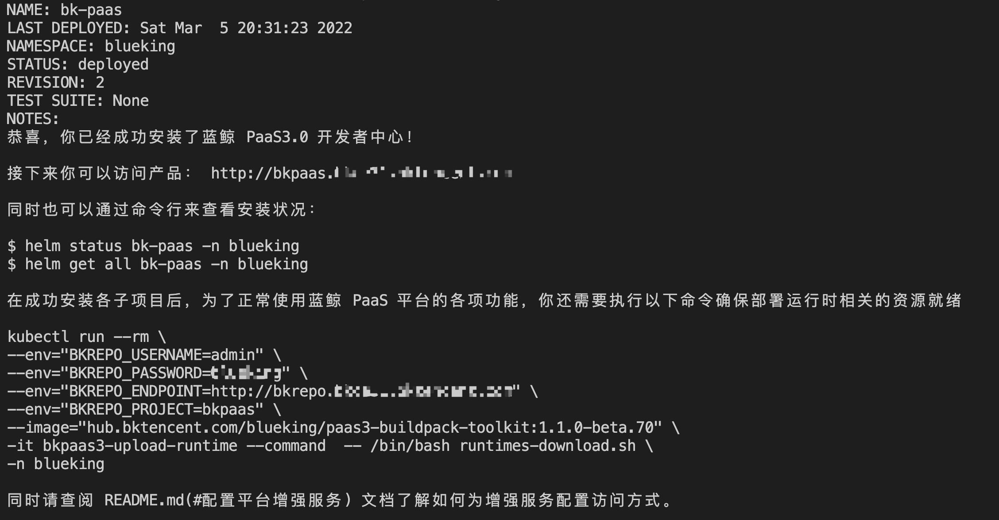
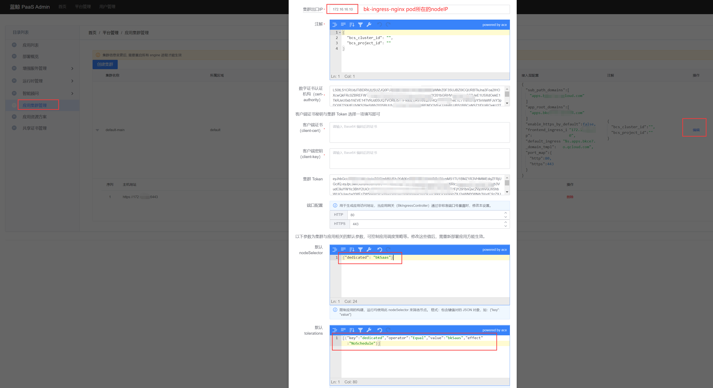
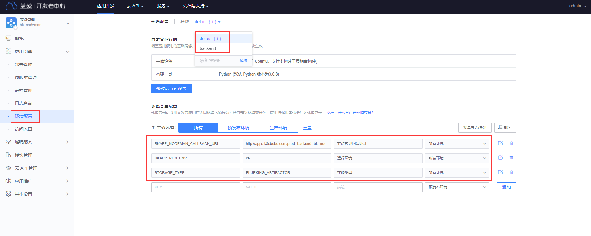
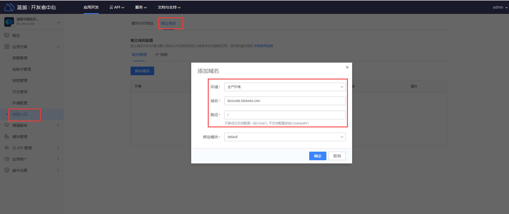
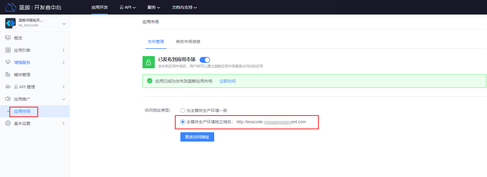
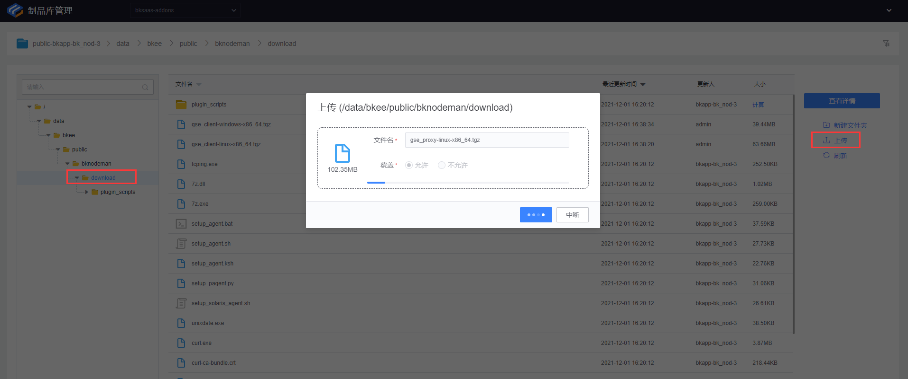
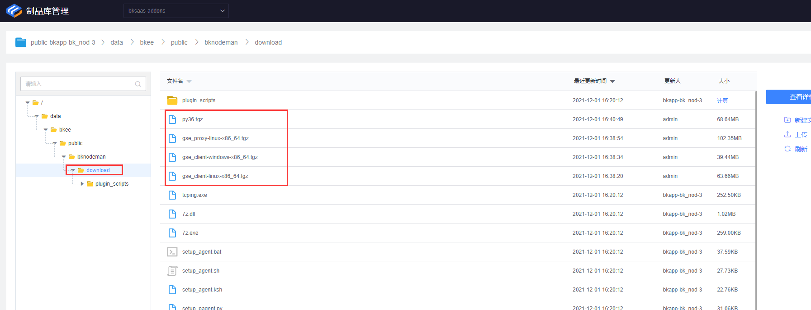

蓝鲸基础套餐的部署主要分为两个部分：先在中控机部署后台；然后在浏览器安装并配置 SaaS 。

# 准备工作
## 中控机安装工具
`jq` 用于在中控机解析服务端 API 返回的 json 数据。

在 **中控机** 执行如下命令：
``` bash
yum install -y jq
```
> **注意**
>
> CentOS 7 在 **`epel`源** 提供了 `jq-1.6`。如果提示 `No package jq available.`，请先确保 **`epel`源** 可用。

## 在中控机配置 ssh 免密登录
本文中会提供命令片段方便您部署。部分命令片段会从中控机上调用 `ssh` 在 k8s node 上执行远程命令，所以需提前配置免密登录。

在 **中控机** 执行如下命令：
``` bash
k8s_nodes_ips=$(kubectl get nodes -o jsonpath='{$.items[*].status.addresses[?(@.type=="InternalIP")].address}')
test -f /root/.ssh/id_rsa || ssh-keygen -N '' -t rsa -f /root/.ssh/id_rsa  # 如果不存在rsa key则创建一个。
# 开始给发现的ip添加ssh key，期间需要您输入各节点的密码。
for ip in $k8s_nodes_ips; do
  ssh-copy-id "$ip" || { echo "failed on $ip."; break; }  # 如果执行失败，则退出
done
```

常见报错：
1. `Host key verification failed.`，且开头提示 `REMOTE HOST IDENTIFICATION HAS CHANGED`: 检查目的主机是否重装过。如果确认没连错机器，可以参考提示（如 `Offending 类型 key in /root/.ssh/known_hosts:行号`）删除 `known_hosts` 文件里的对应行。

# 部署基础套餐后台
## 一键部署基础套餐后台

为了便于您体验，我们封装了“一键部署” 脚本。

``` bash
# 下载部署脚本并添加可执行权限.
curl -Lo ~/setup_bkce7.sh https://bkopen-1252002024.file.myqcloud.com/ce7/setup_bkce7.sh && \
  chmod +x ~/setup_bkce7.sh
```

假设您用于部署蓝鲸的域名为 `bkce7.bktencent.com`，使用如下的命令:
``` bash
BK_DOMAIN=bkce7.bktencent.com  # 请修改为所需的域名
~/setup_bkce7.sh -i base --domain "$BK_DOMAIN"
```

`setup_bkce7.sh` 脚本的参数解析:
1. `-i base`：指定要安装的模块。关键词 `base` 表示基础套餐的后台部分。
2. `--domain BK_DOMAIN`：指定蓝鲸的基础域名（下文也会使用 `BK_DOMAIN` 指代）。<br/>k8s 要求域名中的字母为**小写字母**，可以使用如下命令校验（输出结果中会高亮显示符合规范的部分）：`echo "$BK_DOMAIN" | grep -P '[a-z0-9]([-a-z0-9]*[a-z0-9])(\.[a-z0-9]([-a-z0-9]*[a-z0-9])?)*'` 。

此脚本耗时 15 ~ 30 分钟，请耐心等待。部署成功会高亮提示 `install finished，clean pods in completed status`。

> **提醒**
> 
> k8s 所有 `node` 机器均需保持网络畅通，可访问蓝鲸提供的镜像地址。


## 分步部署基础套餐后台
具体操作请查阅 [分步部署基础套餐后台](base_installing_helmfile.md) 。


# 配置 DNS
针对访问场景的不同，我们需要配置不同的 DNS 记录。为了简化操作，以下步骤皆以 `hosts` 文件为例。

## 配置 coredns
> **提示**
> 
> “一键部署” 脚本中自动完成了此步骤，可以跳过此章节。

我们需要确保 k8s 集群的容器内能解析到 ingress controller。

因此需要注入 hosts 配置项到 `kube-system` namespace 下的 `coredns` 系列 pod，步骤如下：

``` bash
BK_DOMAIN=bkce7.bktencent.com  # 请和 domain.bkDomain 保持一致.
IP1=$(kubectl -n blueking get svc -l app.kubernetes.io/instance=ingress-nginx -o jsonpath='{.items[0].spec.clusterIP}')
IP2=$(kubectl -n blueking get svc -l app=bk-ingress-nginx -o jsonpath='{.items[0].spec.clusterIP}')
./scripts/control_coredns.sh update "$IP1" bkrepo.$BK_DOMAIN docker.$BK_DOMAIN $BK_DOMAIN bkapi.$BK_DOMAIN bkpaas.$BK_DOMAIN bkiam-api.$BK_DOMAIN bkiam.$BK_DOMAIN
./scripts/control_coredns.sh update "$IP2" apps.$BK_DOMAIN
```

确认注入结果，执行如下命令：
``` bash
./scripts/control_coredns.sh list
```
其输出如下：
``` plain
        10.244.0.4 apps.bkce7.bktencent.com
        10.244.0.5 bkrepo.bkce7.bktencent.com
        10.244.0.5 docker.bkce7.bktencent.com
        10.244.0.5 bkce7.bktencent.com
        10.244.0.5 bkapi.bkce7.bktencent.com
        10.244.0.5 bkpaas.bkce7.bktencent.com
        10.244.0.5 bkiam-api.bkce7.bktencent.com
        10.244.0.5 bkiam.bkce7.bktencent.com
        10.244.0.5 bcs.bkce7.bktencent.com
```

## 配置 k8s node 的 DNS
k8s node 需要能从 bkrepo 中拉取镜像。因此需要配置 DNS 。

因为 node 上均有虚拟网络的路由，因此我们使用持久化的 `clusterIP`。以免频繁刷新 hosts 文件。

``` bash
BK_DOMAIN=bkce7.bktencent.com  # 请和 domain.bkDomain 保持一致.
IP1=$(kubectl -n blueking get svc -l app.kubernetes.io/instance=ingress-nginx -o jsonpath='{.items[0].spec.clusterIP}')
IP2=$(kubectl -n blueking get svc -l app=bk-ingress-nginx -o jsonpath='{.items[0].spec.clusterIP}')
cat <<EOF
$IP1 $BK_DOMAIN
$IP1 bkrepo.$BK_DOMAIN
$IP1 docker.$BK_DOMAIN
$IP2 apps.$BK_DOMAIN
EOF
```

## 配置中控机的 DNS
当中控机为 k8s 集群的成员时，可以参考 “配置 k8s node 的 DNS” 章节改为取 `clusterIP`。

当中控机非 k8s 集群成员时，需要使用 node 的内网 IP (`hostIP`)。
> **注意**
>
> 当使用 node 内网 IP 时，请在 pod 迁移到其他 node 后刷新 hosts 文件。

``` bash
BK_DOMAIN=bkce7.bktencent.com  # 请和 domain.bkDomain 保持一致.
IP1=$(kubectl -n blueking get pods -l app.kubernetes.io/name=ingress-nginx -o jsonpath='{.items[0].status.hostIP}')
IP2=$(kubectl -n blueking get pods -l app=bk-ingress-nginx -o jsonpath='{.items[0].status.hostIP}')
# 配置本地host
cat <<EOF
$IP1 $BK_DOMAIN
$IP1 bkrepo.$BK_DOMAIN
$IP1 docker.$BK_DOMAIN
$IP1 bkpaas.$BK_DOMAIN
$IP1 bkuser.$BK_DOMAIN
$IP1 bkuser-api.$BK_DOMAIN
$IP1 bkapi.$BK_DOMAIN
$IP1 apigw.$BK_DOMAIN
$IP1 bkiam.$BK_DOMAIN
$IP1 bkiam-api.$BK_DOMAIN
$IP1 cmdb.$BK_DOMAIN
$IP1 job.$BK_DOMAIN
$IP1 jobapi.$BK_DOMAIN
$IP2 apps.$BK_DOMAIN
EOF
```

## 配置用户侧的 DNS
蓝鲸设计为需要通过域名访问使用。所以您需先配置所在内网的 DNS 系统，或修改本机 hosts 文件。

在 **中控机** 执行如下命令即可获得 hosts 文件的参考内容（如果有新增 node，记得提前更新 ssh 免密）：
``` bash
cd ~/bkhelmfile/blueking/  # 进入蓝鲸helmfile目录
BK_DOMAIN=$(yq e '.domain.bkDomain' environments/default/custom.yaml)  # 默认从配置中提取, 也可自行赋值

# 获取 ingress-controller pod所在机器的公网ip，记为$IP1
IP1=$(kubectl get pods -n blueking -l app.kubernetes.io/name=ingress-nginx \
  -o jsonpath='{.items[0].status.hostIP}')
# 获取外网ip
IP1=$(ssh $IP1 'curl -sSf ip.sb')
# 获取 bk-ingress-controller pod所在机器的公网ip，记为$IP2，它负责SaaS应用的流量代理。
IP2=$(kubectl get pods -n blueking -l app.kubernetes.io/name=bk-ingress-nginx \
  -o jsonpath='{.items[0].status.hostIP}')
# 获取外网ip
IP2=$(ssh $IP2 'curl -sSf ip.sb')
# 人工检查取值
echo "BK_DOMAIN=$BK_DOMAIN IP1=$IP1 IP2=$IP2"
# 输出hosts
cat <<EOF
$IP1 $BK_DOMAIN
$IP1 bkrepo.$BK_DOMAIN 
$IP1 bkpaas.$BK_DOMAIN 
$IP1 bkuser.$BK_DOMAIN
$IP1 bkuser-api.$BK_DOMAIN
$IP1 bkapi.$BK_DOMAIN 
$IP1 apigw.$BK_DOMAIN
$IP1 bkiam.$BK_DOMAIN
$IP1 bkiam-api.$BK_DOMAIN
$IP1 cmdb.$BK_DOMAIN 
$IP1 job.$BK_DOMAIN 
$IP1 jobapi.$BK_DOMAIN 
$IP2 apps.$BK_DOMAIN
EOF
```

# 访问蓝鲸
## 获取 PaaS 登录账户及密码
在 **中控机** 执行如下命令获取登录账户:

``` bash
helm status bk-user -n blueking
```
其关键输出如下: 
``` plain
登录账户名密码:
admin/密码略
```

## 浏览器访问
浏览器访问 `$BK_DOMAIN` 所指向的域名。此域名可以在 **中控机** 执行如下命令获取：
``` bash
cd ~/bkhelmfile/blueking/  # 进入蓝鲸helmfile目录
yq e '.domain.bkDomain' environments/default/custom.yaml  # 读取自定义的域名.
```

# 准备 SaaS 运行环境

## 上传 PaaS runtime 到 bkrepo

在 **中控机** 获取需要执行的命令：
``` bash
helm status bk-paas -n blueking
```
其输出如图所示：

在 **中控机** 执行所提示的命令即可运行 `runtimes-download.sh` 脚本：
``` bash
kubectl run --rm \
--env="BKREPO_USERNAME=admin" \
--env="BKREPO_PASSWORD=略" \
--env="BKREPO_ENDPOINT=http://bkrepo.略" \
--env="BKREPO_PROJECT=bkpaas" \
--image="hub.bktencent.com/blueking/paas3-buildpack-toolkit:1.1.0-beta.70" \
-it bkpaas3-upload-runtime --command  -- /bin/bash runtimes-download.sh \
-n blueking
```

> 此处 `runtimes-download.sh` 脚本从蓝鲸官方资源库下载依赖 SaaS 必需的 `runtime` （运行时资源）并上传到私有化环境中的 bkrepo 仓库。
> 
> 要求 k8s node 能访问外网，如果因网络问题下载异常，可以重复运行此脚本。


## 在 PaaS 界面配置 Redis 资源池
需要添加 SaaS 使用的 Redis 资源池。

> **提示**
>
> 目前 Redis 资源池分为 2 类：
> - `0shared`：共享实例。池内实例允许重复以供多个 SaaS 复用。由 SaaS 自主规避 `key` 冲突。
> - `1exclusive`：独占实例。池内实例不应该重复，否则可能因为 `key` 冲突而影响 SaaS 运行。

1. 先登录「开发者中心」。访问 `http://bkpaas.$BK_DOMAIN` （需替换 `$BK_DOMAIN` 为您配置的蓝鲸基础域名。）
2. 访问蓝鲸 PaaS Admin（如果未登录则无法访问）： `http://bkpaas.$BK_DOMAIN/backend/admin42/platform/pre-created-instances/manage` 。
3. 在 「`0shared`」这行点击 「添加实例」，重复添加 5 - 10 次（蓝鲸基础套餐会占用 4 个实例，余量可供后续安装的 SaaS 使用）。如需保障 SaaS 性能，可使用自建的 Redis 服务（需确保 k8s node 可访问）。如果部署 SaaS 时提示 “分配不到 redis”，则需补充资源实例。

启用 “可回收复用” 开关，并在 “实例配置” 贴入配置代码，在 **中控机** 执行如下命令生成：
    ``` bash
    redis_json_tpl='{"host":"%s","port": %d,"password":"%s"}'
    redis_host="bk-redis-master.blueking.svc.cluster.local"  # 默认用蓝鲸默认的redis，可自行修改
    redis_port=6379  # 按需修改
    redis_pass=$(kubectl get secret --namespace blueking bk-redis \
      -o jsonpath="{.data.redis-password}" | base64 --decode)  # 读取默认redis的密码，按需修改赋值语句
    printf "$redis_json_tpl\n" "$redis_host" "$redis_port" "$redis_pass" | jq .  # 格式化以确保json格式正确
    ```
    命令输出如下图所示：
    
    浏览器界面如下图所示：
    

### 配置 node 上的 docker 服务
PaaS 支持 `image` 格式的 `S-Mart` 包，部署过程中需要访问 bkrepo 提供的 docker registry 服务。

因为 docker 默认使用 https 协议访问 registry，因此需要额外配置。一共有 2 种配置方案：
1. 配置 docker 使用 http 访问 registry（推荐使用，步骤见下文）。
2. 配置 docker 使用 https 访问 registry（暂无文档，请根据如下提示自行研究）：
   1. 用户购买了商业证书： 仅在 bkrepo 配置 docker 域名的证书即可。
   2. 用户自签的证书： 需要在 bkrepo 配置 docker 域名的证书，且在 node 添加自签证书到操作系统 CA 库并重启 docker 服务。

#### 配置 docker 使用 http 访问 registry
在 SaaS 专用 node （如未配置专用 node，则为全部 node ）上执行命令生成新的配置文件：
``` bash
BK_DOMAIN="bkce7.bktencent.com"  # 请按需修改
cat /etc/docker/daemon.json | jq '.["insecure-registries"]+=["docker.'$BK_DOMAIN'"]'
```

检查内容无误后，即可将上述内容写入此 node 上的 `/etc/docker/daemon.json`。如果这些 node 的配置文件相同，您可以在中控机生成新文件后批量替换。

然后 reload docker 服务使之生效：
``` bash
systemctl reload docker
```
检查确认已经生效：
``` bash
docker info
```
预期可看到新添加的 `docker.$BK_DOMAIN` ，如果没有，请检查 docker 服务是否成功 reload：
``` yaml
 Insecure Registries:
  docker.bkce7.bktencent.com
  127.0.0.0/8
```

## 配置 SaaS 专用 node （可选）
在资源充足的情况下，建议单独给 SaaS 分配单独的 `node`。因为 SaaS 部署时，编译会产生高 IO 和高 CPU 消耗。原生 k8s 集群的 io 隔离暂无方案，这样会影响到所在 `node` 的其他 `pod`。

我们通过 k8s 的污点（`taint`）来实现专机专用。

### 配置 node 污点
假设该节点名为 `node-1`，给该 node 配置 label 和污点，确保 `pod` 默认不会分配到这些 `node`。
``` bash
kubectl label nodes node-1 dedicated=bkSaas
kubectl taint nodes node-1 dedicated=bkSaas:NoSchedule
```
### 在 PaaS 页面配置污点容忍
1. 先登录。访问 `http://bkpaas.$BK_DOMAIN` （需替换 `$BK_DOMAIN` 为您配置的蓝鲸基础域名。）
2. 访问蓝鲸 PaaS Admin（如果未登录则无法访问）： `http://bkpaas.$BK_DOMAIN/backend/admin42/platform/clusters/manage/` 。
3. 点击集群 最右侧的编辑按钮，并滚动到最下面。
4. 在 **默认 nodeSelector** 栏填写：
``` json
{"dedicated": "bkSaas"}
```
5. 在 **默认 tolerations** 栏填写：
``` json
[{"key":"dedicated","operator":"Equal","value":"bkSaas","effect":"NoSchedule"}]
```
6. 保存


### SaaS 专用 node 问题排查
如果发现 SaaS 的 Pod 调度到了其他 `node`，请检查 PaaS 页面的配置是否正确。

如果因为资源不足导致 SaaS 运行异常，请先参考 **添加 k8s-node** 完成 k8s 扩容，然后参考 **配置 node 污点** 完成专机配置。


# 部署蓝鲸基础套餐 SaaS 
> **提示**
> 
> 1. 目前安装 SaaS 需要在浏览器操作，记得先完成 **访问蓝鲸** 章节的内容。
> 2. SaaS 运行前需要先完成 **准备 SaaS 运行环境** 章节的内容。

在前面部署蓝鲸套件里包含了 PaaS 平台 V3、配置平台、作业平台、gse 几个原子平台和用户管理、权限中心两个公共模块，其他社区版官方的 SaaS 应用，比如标准运维、节点管理、流程服务等通过开发者中心来自助部署

## 部署 S-Mart 包
SaaS 应用采用 `S-Mart` 包分发，部署方法：

登录 「蓝鲸工作台」，在顶部导航栏里打开 「开发者中心」 ，点击 「创建应用」，选择 「S-mart 应用」 ，上传包。

上传成功后，点击 「部署应用」。


如果存在部署前配置（如 环境变量），需参考文档先完成配置，然后才能部署。

先确认顶部的 「模块」 为需要部署的模块，然后切换下方面板到 「生产环境」，选择刚才上传的版本点击 「部署至生产环境」 按钮。此时开始显示部署进度。


## 需要提前下载的资源
我们汇总整理了接下来需要下载的文件。

1. SaaS 集合包 文件名：ce7_saas.tgz
    - MD5：ad0f2bea16e52c496c5ec70f2097e5eb
    - 下载地址：https://bkopen-1252002024.file.myqcloud.com/ce7/ce7_saas.tgz
2. GSE Agent 集合包 文件名：gse_client_ce_3.6.16.zip
    - MD5：9a2d4f3d0034ea37a6c5cb8f7c4e399a
    - 下载地址：https://bkopen-1252002024.file.myqcloud.com/ce7/gse_client_ce_3.6.16.zip
3. Python 3.6 文件名：py36.tgz
    - MD5：7f9217b406703e3e3ee88681dd903bd1
    - 下载地址：https://bkopen-1252002024.file.myqcloud.com/common/py36.tgz
4. GSE 插件集合包 文件名：gse_plugins.tgz
    - MD5：d29be1a7e5b05c9aee54e9f0437b3f72
    - 下载地址：https://bkopen-1252002024.file.myqcloud.com/gse_plugins/gse_plugins.tgz

## 各 SaaS 部署过程
> **提示**
>
> 解压刚才下载的 SaaS 集合包，即可得到各个 SaaS 安装所需的 `S-Mart` 包。

### 部署流程服务（bk_itsm）

SaaS 包名：`bk_itsm_V*.tar.gz`

无部署前配置，部署 `default` 模块即可。

部署步骤请参考 **部署 S-Mart 包** 章节。

### 部署进程配置管理（bk_gsekit）

SaaS 包名：`bk_gsekit-V*.tar.gz`

无部署前配置，部署 `default` 模块即可。

### 部署标准运维（bk_sops）

SaaS 包名：`bk_sops-V*.tar.gz`

无部署前配置，共有 **四个模块** 需要部署。

需要先部署 `default` ，然后才能部署 `api`、`pipeline`、`callback` 等 3 个模块（无顺序要求，可同时部署）。


### 部署蓝鲸可视化平台（bk_lesscode）

SaaS 包名：`bk_lesscode-ee-V*.tar.gz`

先配置 「环境变量」，然后部署 `default` 模块即可。

配置 **环境变量**：

进入 「应用引擎」 - 「环境配置」页面，在「环境变量配置」下方填写环境变量并点击「添加」按钮。

注意环境变量的作用范围，可以直接选所有环境

|环境变量名称 |VALUE |描述 |
| -- | -- | -- |
|`PRIVATE_NPM_REGISTRY` |按以下模板填写: `${bkrepoConfig.endpoint}/npm/bkpaas/npm/` , 其中 bkrepoConfig.endpoint 为 bkrepo 服务的网关地址,即http://bkrepo.$BK_DOMAIN |npm 镜像源地址 |
|`PRIVATE_NPM_USERNAME` |填写部署 PaaS3.0 时配置的 `bkrepoConfig.lesscodeUsername` 默认值是 bklesscode |npm 账号用户名 |
|`PRIVATE_NPM_PASSWORD` |填写部署 PaaS3.0 时配置的 `bkrepoConfig.lesscodePassword` 默认值是 blueking |npm 账号密码 |
|`BKAPIGW_DOC_URL` |填写部署 API 网关时，生成的环境变量 APISUPPORT_FE_URL 的值 默认值是 `http://apigw.$BK_DOMAIN/docs` |云 API 文档地址 |

最终配置界面如下图所示：

部署应用到所需的环境


### 部署节点管理（bk_nodeman）

SaaS 包名：`bk_nodeman-V*.tar.gz`

先配置 「环境变量」，共有 **两个模块** 需要部署。

在各自模块提前配置以下 3 个环境变量 ：

|环境变量名称 |VALUE |描述 |
|--|--|--|
|STORAGE_TYPE |BLUEKING_ARTIFACTORY |存储类型 |
|BKAPP_RUN_ENV |ce |运行环境 |
|BKAPP_NODEMAN_CALLBACK_URL |http://apps.$BK_DOMAIN/prod--backend--bk--nodeman/backend |节点管理回调地址 |

> **提示**:
> 
> 1. 配置一次 `default` 模块的变量后，`backend` 的变量可以从 `default` 模块导入。
> 2. 环境变量的作用范围，可以直接选所有环境。




需要先部署 `default` ，然后部署 `backend` 模块。

## SaaS 部署后的设置
> **提示**
>
> 一些 SaaS 在部署成功后，还需要做初始化设置。

### 蓝鲸可视化平台（bk_lesscode）部署后配置
目前 bk_lesscode 只支持通过独立域名来访问。

在 bk_lesscode 应用页中, 点击 「应用引擎」-「访问入口」中配置独立域名并保存。
如果没有配置公网 DNS 解析，则在本地 hosts 需要加上
1.1.1.1（ `bk-ingress-controller` pod 所在机器的公网 IP） `lesscode.$BK_DOMAIN`

在应用推广-发布管理中，将应用市场的访问地址类型设置为：主模块生产环境独立域名


### 节点管理（bk_nodeman）部署后配置
#### 配置 GSE 环境管理
点击全局配置->gse 环境管理->默认接入点->编辑，相关信息需要用以下命令行获取。

zookeeper 集群地址填写任意 k8s node IP，端口填写 `32181` （注意不是默认的 `2181`）。然后查询 zookeeper 用户名和密码：
``` bash
helm get values bk-gse-ce -n blueking | grep -A 2 externalZookeeper
```

Btserver，dataserver，taskserver 的地址，先都填入 `127.0.0.1` 即可。后台任务一分钟后，会从 zookeeper 获取到最新的后台服务地址。

外网回调地址：http://apps.$BK_DOMAIN/prod--backend--bk--nodeman/backend

agent url: 将默认的 http://bkrepo.$BK_DOMAIN/ 部分换成 `http://node_ip:30025/` （任意 k8s node IP） 后面目录路径保持不变。`30025` 是 bkrepo 暴露的 NodePort，这样可以使用 ip 来下载，无需配置 agent 端的域名解析。

最终配置界面如下图所示：


点击 “测试 Server 及 URL 可用性”，然后点击 “下一步”。在新的 agent 信息界面点击 “确认” 保存。回到查看界面，请等待 1 ~ 2 分钟，然后刷新此页面。

如果 Btserver，dataserver，taskserver 的地址自动从 `127.0.0.1` 变更为 node 的内网 IP ，则说明读取 zookeeper 成功，否则需检查 zookeeper 的 IP、 端口以及账户密码是否正确。

#### agent 资源上传
下载 agent 合集包：[https://bkopen-1252002024.file.myqcloud.com/ce7/gse_client_ce_3.6.16.zip](https://bkopen-1252002024.file.myqcloud.com/ce7/gse_client_ce_3.6.16.zip)

本机解压 zip 包后，分别上传 agent 包到 bkrepo 中（`bkrepo.$BK_DOMAIN` 登陆账号密码可以通过： `helm status -n blueking bk-repo` 获取。先找到 `bksaas-addons` 项目，节点管理对应的目录（public-bkapp-bk_nod-x/data/bkee/public/bknodeman/download ），每次只能上传一个包，需要分多次上传。



下载 py36 解释器包，部署 gse proxy 安装 gse p-agent 需要用到：[https://bkopen-1252002024.file.myqcloud.com/common/py36.tgz](https://bkopen-1252002024.file.myqcloud.com/common/py36.tgz) 上传到和第一步 agent 的同级目录。

#### gse 插件包
上传基础插件包（bknodeman 的页面上传），解压 `gse_plugins.tgz` ，单独上传里面的小包 `*.tgz`。

#### 给 node 安装 gse agent
节点管理安装成功后，可以给蓝鲸集群的 node 机器安装 gse_agent。

1. （可选）如果存在，则先停掉 gse 部署时自动安装的 gse_agent daemonset 资源。
    ``` bash
    kubectl delete daemonsets.apps bk-gse-agent -n blueking
    ```
2. 节点管理上，通过直连区域安装 gse_agent。如果 node 机器上，无法解析 `apps.$BK_DOMAIN` 和 `bkrepo.$BK_DOMAIN` 域名，则需要在 node 上配置 `/etc/hosts` 实现解析。
`apps.$BK_DOMAIN` 解析到 `bk-ingress-controller` pod 所在 node 机器。
`bkrepo.$BK_DOMAIN` 解析到 `ingress-controller` pod 所在 node 机器。

