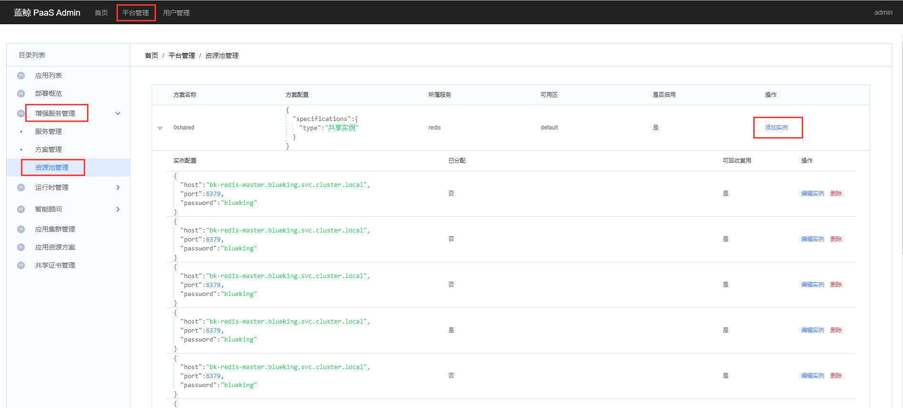
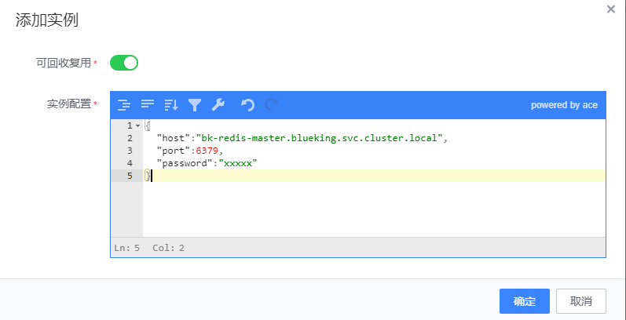
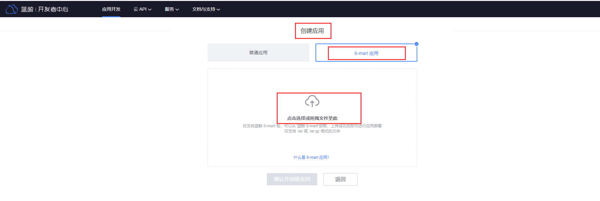
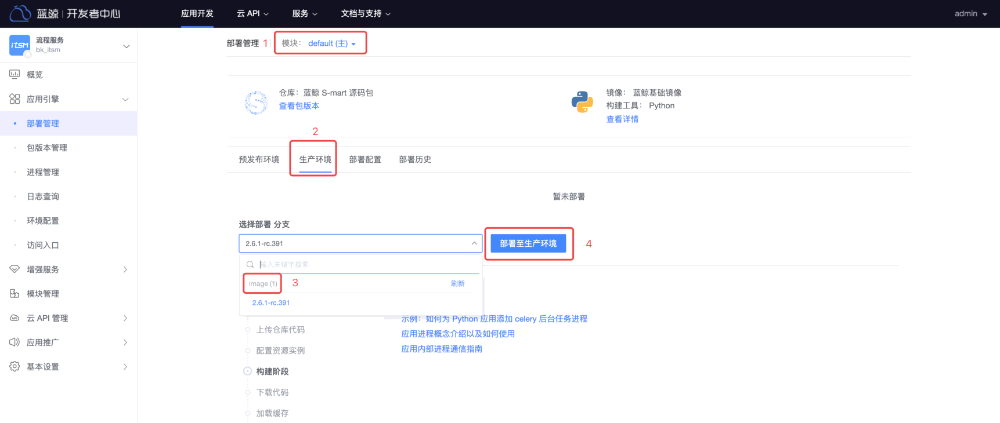

我们已经提供了“一键脚本”，可以完成本文档的大部分内容，如果还没阅读过《[基础套餐部署](install-bkce.md)》文档，请先阅读一次。

# 手动部署基础套餐 SaaS

<a id="saas-res-download" name="saas-res-download"></a>

## 需要提前下载的资源
资源一共分为 2 类：
1. SaaS 安装包。
2. 托管在节点管理上的文件： GSE 客户端、插件及其他文件。

在您开始下载后，可以继续跟随文档完成一些初始设置，待下载完成后部署 SaaS。

### SaaS 安装包
需要您在浏览器中下载，随后在开发者中心上传并部署。

| 名字及 app_code | 版本号 | 下载链接 |
|--|--|--|
| 流程服务（bk_itsm） | 2.6.1.391 | https://bkopen-1252002024.file.myqcloud.com/saas-paas3/bk_itsm/bk_itsm-V2.6.1.391.tar.gz |
| 标准运维（bk_sops） | 3.25.2 | https://bkopen-1252002024.file.myqcloud.com/saas-paas3/bk_sops/bk_sops-V3.25.2.tar.gz |
| 节点管理（bk_nodeman） | 2.2.20 | 使用 helmfile 部署时自动下载 Charts，此处无需下载 |

### 节点管理托管文件

鉴于需要下载上传的文件众多，浏览量下载上传会非常繁琐。因此我们推荐使用下载脚本处理，请在 **中控机** 下载所需的文件，然后使用脚本上传。

* 一般情况下只需要下载节点管理托管的常用文件即可（包含 Linux 及 Windows 的 64 位 GSE 客户端及插件包）。
    ``` bash
    curl -sSf https://bkopen-1252002024.file.myqcloud.com/ce7/7.0-beta/bkdl-7.0-beta.sh | bash -s -- -ur latest nm_gse_freq  # 下载节点管理托管的常用文件
    ```
* 如果需要下载完整的托管文件（包含多云区域管理所需的 `gse_proxy`，以及其他不常用 CPU 及操作系统的客户端及插件包）：
    ``` bash
    curl -sSf https://bkopen-1252002024.file.myqcloud.com/ce7/7.0-beta/bkdl-7.0-beta.sh | bash -s -- -ur latest nm_gse_full
    ```

## 在 PaaS 界面配置 Redis 资源池
添加 SaaS 使用的 Redis 资源池。如果部署 SaaS 时提示 “分配不到 redis”，则需补充资源实例。

>**提示**
>
>目前 Redis 资源池分为 2 类：
>- `0shared`：共享实例。池内实例允许重复以供多个 SaaS 复用。由 SaaS 自主规避 `key` 冲突。
>- `1exclusive`：独占实例。池内实例不应该重复，否则可能因为 `key` 冲突而影响 SaaS 运行。

先登录「开发者中心」。访问 `http://bkpaas.$BK_DOMAIN` （需替换 `$BK_DOMAIN` 为您配置的蓝鲸基础域名。）

访问蓝鲸 PaaS Admin（如果未登录则无法访问）： `http://bkpaas.$BK_DOMAIN/backend/admin42/platform/pre-created-instances/manage` 。

在 「`0shared`」这行点击 「添加实例」，重复添加 5 - 10 次（蓝鲸基础套餐会占用 4 个实例，余量可供后续安装的 SaaS 使用）。如需保障 SaaS 性能，可使用自建的 Redis 服务（需确保 k8s node 可访问）。


启用 “可回收复用” 开关，并在 “实例配置” 贴入配置代码，在 **中控机** 执行如下命令生成：
``` bash
redis_json_tpl='{"host":"%s","port": %d,"password":"%s"}'
redis_host="bk-redis-master.blueking.svc.cluster.local"  # 默认用蓝鲸默认的redis，可自行修改
redis_port=6379  # 按需修改
redis_pass=$(kubectl get secret --namespace blueking bk-redis \
  -o jsonpath="{.data.redis-password}" | base64 --decode)  # 读取默认redis的密码，按需修改赋值语句
printf "$redis_json_tpl\n" "$redis_host" "$redis_port" "$redis_pass" | jq .  # 格式化以确保json格式正确
```
命令输出如下图所示：

浏览器界面如下图所示：



<a id="deploy-bkce-saas" name="deploy-bkce-saas"></a>

## 各 SaaS 部署过程

<a id="deploy-bkce-saas-itsm" name="deploy-bkce-saas-itsm"></a>

### 部署流程服务（bk_itsm）

SaaS 应用采用 `S-Mart` 包分发。

登录 「蓝鲸桌面」，在侧栏导航里打开 「开发者中心」 。

点击 「创建应用」，选择 「S-mart 应用」 ，上传提前下载好的安装包。

上传成功后，界面会显示解析到信息，点击 「确认并创建应用」。稍等片刻后提示“应用‘流程服务’创建成功”，此时可点击下方的 「部署应用」链接进入「部署管理」界面。


流程服务（bk_itsm） **无部署前配置**，所以可以直接在 「部署管理」 界面开始部署：
1. 顶部的「模块」 为将要部署的模块，流程服务（bk_itsm）只有 1 个 `default` 模块需要部署。
2. 然后切换下方面板到 「生产环境」。
3. 选择刚才上传的版本（为 `image`）。
4. 点击 「部署至生产环境」 按钮。此时开始显示部署进度。

步骤示例图：



<a id="deploy-bkce-saas-nodeman" name="deploy-bkce-saas-nodeman"></a>

### 部署节点管理（bk_nodeman）
目前节点管理已经改为了 Charts 形态，通过 helmfile 进行部署。

>**注意**
>
>如果已经部署了 S-Mart 应用格式的节点管理，则无法直接升级。灰度期间建议卸载蓝鲸，重新部署。因为应用「基本信息」界面的“删除应用”按钮无法彻底删除。

安装节点管理之前，保障中控机上能解析 `bkrepo.$BK_DOMAIN` 的域名，因为安装时会自动调用脚本在 bkrepo 中创建 bucket。
``` bash
cd ~/bkhelmfile/blueking/  # 进入工作目录
helmfile -f base-blueking.yaml.gotmpl -l name=bk-nodeman sync
```

<a id="bkconsole-add-app-saas" name="bkconsole-add-app-saas"></a>

## 为用户桌面添加应用
>**提示**
>
>使用“一键部署” 脚本部署 标准运维、流程服务及节点管理 时，会自动完成此步骤。

用户初次登录蓝鲸桌面时，会在第一个桌面看到自动添加的 **默认应用**。当然也可由用户手动添加其他应用。

在部署 SaaS 成功后，管理员可能希望让全部用户桌面直接出现这个应用。

那么可以组合如下的脚本达成效果：
* 使用 `set_desktop_default_app.sh` 将应用设置为 **默认应用**。<br/>
  如果用户已经登录，则 **此后设置的默认应用** 不会添加到该用户的桌面。
* 使用 `add_user_desktop_app.sh` 为 **已登录过桌面的用户** 添加应用到第一个桌面。<br/>
  如果用户未曾登录过，不应该使用此脚本，因为这样做会导致为新用户桌面添加 **默认应用** 的逻辑失效。

脚本用法如下：
``` bash
cd ~/bkhelmfile/blueking/  # 进入工作目录
# 将 bk_itsm, bk_sops 和 bk_nodeman 设为默认应用。
./scripts/set_desktop_default_app.sh -a "bk_itsm,bk_sops,bk_nodeman"
# 在之前的步骤中，用户 admin 已经登录过桌面。默认应用对其无效，需要主动为其添加。
./scripts/add_user_desktop_app.sh -u "admin" -a "bk_itsm,bk_sops,bk_nodeman"
```

脚本执行成功无输出；如果失败，会显示报错。

常见报错：
* app_code 有误，输出为 `App(app-code-not-exist) not exists`。


<a id="post-install-bk-saas" name="post-install-bk-saas"></a>

## SaaS 部署后的设置
>**提示**
>
>一些 SaaS 在部署成功后，还需要做初始化设置。

<!--
<a id="post-install-bk-lesscode" name="post-install-bk-lesscode"></a>

### 蓝鲸可视化平台（bk_lesscode）部署后配置
目前 bk_lesscode 只支持通过独立域名来访问。我们约定使用了 `lesscode` 作为前缀，暂时不能自定义其他名称。

操作步骤：
1. 在 bk_lesscode 应用页中, 点击 「应用引擎」-「访问入口」中配置独立域名并保存。
2. 在应用推广-发布管理中，将应用市场的访问地址类型设置为：主模块生产环境独立域名

步骤示例图：


-->

<a id="post-install-bk-nodeman" name="post-install-bk-nodeman"></a>

### 节点管理（bk_nodeman）部署后配置

<a id="post-install-bk-nodeman-gse-client" name="post-install-bk-nodeman-gse-client"></a>

#### agent 资源上传
>**提示**
>
>如果您使用了“一键部署” 脚本部署 `nodeman` ，则自动完成了此步骤，可以跳过本章节。

在前面的操作中，我们已经在中控机下载了所需的文件，如需更新文件，请查阅本文“提前下载资源”章节。

在 **中控机** 执行如下命令同时上传 agent 资源及 gse 插件：
``` bash
cd ~/bkhelmfile/blueking/  # 进入工作目录
./scripts/setup_bkce7.sh -u agent  # 更新节点管理托管的agent资源及gse插件。
```


<a id="post-install-bk-nodeman-gse-plugin" name="post-install-bk-nodeman-gse-plugin"></a>

#### 上传 gse 插件包
>**提示**
>
>* 如果您使用了“一键部署” 脚本部署 `nodeman` ，则自动完成了此步骤，可以跳过本章节。
>* 如果您已经参考“agent 资源上传”章节在中控机执行了脚本，则也完成了此步骤，可以跳过本章节。

在前面的操作中，我们已经在中控机下载了所需的文件，如需更新文件，请查阅本文“提前下载资源”章节。

在 **中控机** 执行如下命令同时上传 agent 资源及 gse 插件：
``` bash
cd ~/bkhelmfile/blueking/  # 进入工作目录
./scripts/setup_bkce7.sh -u agent  # 更新节点管理托管的agent资源及gse插件。
```
结尾提示 `[INFO] upload agent package success` （客户端及 proxy） 和 `[INFO] upload open tools success` （proxy 所需的 nginx 及 py36 等）即为上传成功。

脚本执行完成后，访问节点管理的 「插件管理」——「插件包」界面，可以看到上传成功的插件包：


插件集合包中各子包的用途：
| 插件包名 | 用途 | 描述 |
| -- | -- | -- |
| bkmonitorbeat | 蓝鲸监控指标采集器 | 蓝鲸监控拨测采集器 支持多协议多任务的采集，监控和可用率计算，提供多种运行模式和热加载机制 |
| bkmonitorproxy | 自定义上报服务 | 自定义数据上报服务，用来收集用户自定义上报的时序数据，或事件数据。 |
| bkunifylogbeat | 高性能日志采集 | 数据平台，蓝鲸监控，日志检索等和日志相关的数据. 首次使用插件管理进行操作前，先到日志检索/数据平台等进行设置插件的功能项 |
| gsecmdline | 自定义上报命令行工具 | 蓝鲸监控脚本采集，自定义监控等自定义上报数据 |
| bk-collector | 多协议数据采集 | 蓝鲸监控，日志检索，应用性能监控使用的高性能 Trace、指标、日志接收端，支持 OT、Jaeger、Zipkin 等多种数据协议格式。 |


>**提示**
>
>`bkmonitorbeat-2.x` 完成了采集功能的统一，故新版插件集合包中移除了下列包：
>| 包名 | 用途 | 描述 |
>| -- | -- | -- |
>| exceptionbeat | 系统事件采集器 | 系统事件采集器，用来收集系统事件如磁盘只读，corefile 产生等。 |
>| basereport | 基础性能采集器 | 负责采集 CMDB 上的实时数据，蓝鲸监控里的主机监控，包含 CPU，内存，磁盘等 |
>| processbeat | 主机进程信息采集器 | 蓝鲸监控主机监控里面的进程信息. 首次使用插件管理进行操作前，先到蓝鲸监控进行设置插件的功能项 |


<a id="post-install-bk-nodeman-gse-env" name="post-install-bk-nodeman-gse-env"></a>

#### 配置 GSE 环境管理
请先登录到蓝鲸桌面，打开“节点管理”应用。然后点击顶部导航栏 “全局配置”，会默认进入“gse 环境管理” 界面。

点击 “默认接入点” 右侧的 “编辑” 图标，进入 “编辑接入点” 界面。

填写要求如下：

zookeeper 集群地址填写 **任意 k8s node IP**，端口填写 `32181` （注意不是默认的 `2181`）。用户名和密码可执行如下命令获取 auth 字符串，其格式为 `用户名:密码`。
``` bash
kubectl get -n blueking cm bk-gse-task-config -o go-template --template '{{index .data "gse_task.conf" }}' | jq -r ".zookeeper.token"
# 7.0.0-beta.2及更早版本使用如下命令
# kubectl get -n blueking cm bk-gse-ce-task-config -o go-template --template '{{index .data "task.conf" }}' | jq -r ".zkauth"
```

Btserver、dataserver、taskserver 的 **内网 IP** 及 **外网 IP** 地址默认为空，必须填写。可暂且填入 `127.0.0.1` ，这样后台任务会优先使用从 zk 中读取的服务地址。

agent url: 一般无需修改，默认通过域名访问 bkrepo 下载安装包。如果用户环境不具备配置 DNS 的条件，可使用 IP 直接访问 bkrepo。将默认值里的 `http://bkrepo.$BK_DOMAIN/` 部分换成 `http://node_ip:30025/` （任意 k8s node IP） 后面目录路径保持不变。`30025` 是 bkrepo 暴露的 NodePort。

最终配置界面如下图所示：


点击 “测试 Server 及 URL 可用性”，然后点击 “下一步”。在新的 agent 信息界面点击 “确认” 保存。

回到查看界面后，请 **等待 1 ~ 2 分钟**，然后刷新此页面。如果 Btserver，dataserver，taskserver 的地址自动从 `127.0.0.1` 变更为 node 的内网 IP ，则说明读取 zookeeper 成功，否则需检查 zookeeper 的 IP、 端口以及账户密码是否正确。
