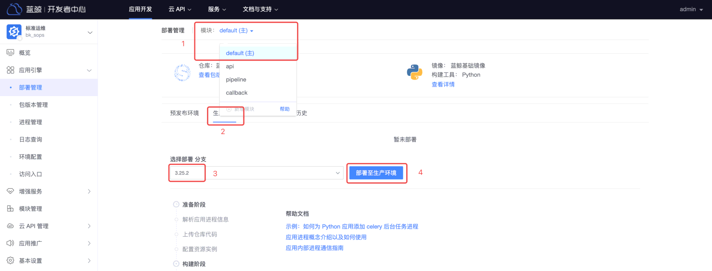

我们在《[部署基础套餐](install-bkce.md#setup_bkce7-i-saas)》文档中使用了“一键脚本”部署标准运维和流程服务，脚本逻辑可以等价于下面的操作。


<a id="saas-res-download" name="saas-res-download"></a>

## 需要提前下载的资源

在您开始下载后，可以继续跟随文档完成一些初始设置，待下载完成后部署 SaaS。

## 下载 SaaS 安装包
需要您先在浏览器中下载，随后访问 “开发者中心” 应用，上传安装包并部署到生产环境。

| 名字及 app_code | 版本号 | 下载链接 |
|--|--|--|
| 流程服务（bk_itsm） | 2.6.6-alpha.4 | https://bkopen-1252002024.file.myqcloud.com/saas-paas3/bk_itsm/bk_itsm-V2.6.6-alpha.4.tar.gz |
| 标准运维（bk_sops） | 3.28.12 | https://bkopen-1252002024.file.myqcloud.com/saas-paas3/bk_sops/bk_sops-V3.28.12.tar.gz |
| 节点管理（bk_nodeman） | 2.3.2-alpha.652 | 使用 helmfile 部署时自动下载 Charts，此处无需下载 |


<a id="paas-svc-redis" name="paas-svc-redis"></a>

## 在 PaaS 界面配置 Redis 资源池
添加 SaaS 使用的 Redis 资源池。如果部署 SaaS 时提示 “分配不到 redis”，则需补充资源实例。

>**提示**
>
>目前 Redis 资源池分为 2 类：
>- `0shared`：共享实例。池内实例允许重复以供多个 SaaS 复用。由 SaaS 自主规避 `key` 冲突。
>- `1exclusive`：独占实例。池内实例不应该重复，否则可能因为 `key` 冲突而影响 SaaS 运行。

先登录「开发者中心」。访问 `http://bkpaas.$BK_DOMAIN` （需替换 `$BK_DOMAIN` 为您配置的蓝鲸基础域名。）

访问蓝鲸 PaaS Admin（如果未登录则无法访问）： `http://bkpaas.$BK_DOMAIN/backend/admin42/platform/pre-created-instances/manage` 。

在 「`0shared`」这行点击 「添加实例」，重复添加 5 - 10 次（蓝鲸基础套餐会占用 4 个实例，余量可供后续安装的 SaaS 使用）。如需保障 SaaS 性能，可使用自建的 Redis 服务（需确保 k8s node 可访问）。


启用 “可回收复用” 开关，并在 “实例配置” 贴入配置代码，在 **中控机** 执行如下命令生成：
``` bash
redis_json_tpl='{"host":"%s","port": %d,"password":"%s"}'
redis_host="bk-redis-master.blueking.svc.cluster.local"  # 默认用蓝鲸默认的redis，可自行修改
redis_port=6379  # 按需修改
redis_pass=$(kubectl get secret --namespace blueking bk-redis \
  -o jsonpath="{.data.redis-password}" | base64 --decode)  # 读取默认redis的密码，按需修改赋值语句
printf "$redis_json_tpl\n" "$redis_host" "$redis_port" "$redis_pass" | jq .  # 格式化以确保json格式正确
```

命令输出如下图所示：


浏览器界面如下图所示：


<a id="upload-bkce-saas" name="upload-bkce-saas"></a>

## 上传安装包
私有化环境里需要先行创建应用并上传安装包，后续更新需在该应用的管理界面上传。

蓝鲸 SaaS 应用采用 `S-Mart` 包分发。你可以在 [S-Mart 市场](https://bk.tencent.com/s-mart/market) 中找到更多应用，也是通过此方法安装。

>**注意**
>
>请选择适配蓝鲸 7.0 的应用，未适配版本可能无法正常运行。
>
>旧版包的安装过程需要构建工具，默认没有安装，请完成《[上传 PaaS runtimes 到 bkrepo](paas-upload-runtimes.md)》文档。

### 创建应用
登录 “蓝鲸桌面”，在侧栏导航里打开 “开发者中心”。

点击右上角的 “创建应用” 按钮，进入“创建应用”界面。

选择 “S-mart 应用”，点击上传区域，选择提前下载的 SaaS 安装包。操作步骤如下图所示：


文件选择成功后，后台会开始检查安装包。并显示解析到的包信息，点击 “确认并创建应用” 按钮开始创建。

>**提示**
>
>如果报错 `应用ID: xxx 的应用已存在!`，说明已经存在应用，需要执行下文的 更新安装包 流程。
>
>其他异常请查阅《[问题案例](troubles.md#install-saas)》文档。

稍等片刻后，会显示成功页面：`恭喜，应用 "应用名称" 创建成功`。此时可点击提示下方常用操作里的 “部署应用” 链接，进入“部署管理”界面开始部署。


### 更新安装包
登录 “蓝鲸桌面”，在侧栏导航里打开 “开发者中心”。

从顶部导航栏进入“应用开发”界面。

点击名称进入应用概览界面，在左侧展开 “应用引擎”目录，点击 “包版本管理”。

在包版本管理界面，点击“上传新版本”按钮，会弹出上传窗口。后续流程和上文 创建应用 类似，此处不再赘述。

新版本上传成功后，在页面左侧导航栏展开 “应用引擎”目录，点击 “部署管理” 开始部署。


<a id="deploy-bkce-saas" name="deploy-bkce-saas"></a>

## 各 SaaS 部署过程

<a id="deploy-bkce-saas-itsm" name="deploy-bkce-saas-itsm"></a>

### 部署流程服务（bk_itsm）
请参考上文 上传安装包 章节完成应用创建或者安装包更新。

流程服务（bk_itsm） **无需额外配置**，所以可以直接在 “部署管理” 界面开始部署。

共有 **一个模块** 需要部署，详细步骤如下：
1. 顶部的“模块”可以选择要部署的模块。流程服务（bk_itsm）只有 `default` 模块，故无需切换。
2. 然后切换下方面板到 “生产环境”。
3. 展开“选择部署分支”下拉框，在 `image` 分组下选择刚才上传的版本（如果计划部署 `package` 分组下的版本，需要先完成《[上传 PaaS runtimes 到 bkrepo](paas-upload-runtimes.md)》文档）。
4. 点击右侧的“部署至生产环境”按钮。部署期间会显示进度及日志。

>**提示**
>
>部署如有异常，请先查阅《[问题案例](troubles.md#install-saas)》文档。

步骤示例图：


<!--
<a id="deploy-bkce-saas-gsekit" name="deploy-bkce-saas-gsekit
"></a>

### 部署进程配置管理（bk_gsekit）

**无需额外配置**，只有 `default` 模块需要部署。

具体步骤可参考 “[部署流程服务（bk_itsm）](#deploy-bkce-saas-itsm)” 章节。
-->

<a id="deploy-bkce-saas-sops" name="deploy-bkce-saas-sops"></a>

### 部署标准运维（bk_sops）
请参考上文 上传安装包 章节完成应用创建或者安装包更新。

标准运维（bk_sops）**无需额外配置**，共有 **四个模块** 需要部署，详细操作可参考 流程服务，此处仅为概述：
1. 选择部署模块，需要先部署 `default` 模块。
2. 选择 生产环境。
3. 选择版本。
4. 点击 “部署至生产环境” 按钮。
5. 等 `default`模块 **部署成功后**，开始部署 `api`、`pipeline`与`callback` 等 3 个模块（无次序要求，可同时部署）。重复步骤 1-4，每轮操作注意**切换模块**。

模块位置及点击次序见图：




<a id="deploy-bkce-saas-nodeman" name="deploy-bkce-saas-nodeman"></a>

### 部署节点管理（bk_nodeman）
目前节点管理已经改为了 Charts 形态，通过 `helmfile` 命令进行部署。

安装节点管理之前，保障中控机上能解析 `bkrepo.$BK_DOMAIN` 的域名，因为安装时会自动调用脚本在 bkrepo 中创建 bucket。
``` bash
cd ~/bkce7.1-install/blueking/  # 进入工作目录
helmfile -f base-blueking.yaml.gotmpl -l name=bk-nodeman sync
```

<a id="bkconsole-add-app-saas" name="bkconsole-add-app-saas"></a>

## 为用户桌面添加应用
>**提示**
>
>使用“一键部署” 脚本部署 标准运维、流程服务及节点管理 时，会自动完成此步骤。

用户初次登录蓝鲸桌面时，会在第一个桌面看到自动添加的 **默认应用**。当然也可由用户手动添加其他应用。

在部署 SaaS 成功后，管理员可能希望让全部用户桌面直接出现这个应用。

那么可以组合如下的脚本达成效果：
* 使用 `set_desktop_default_app.sh` 将应用设置为 **默认应用**。<br/>
  如果用户已经登录，则 **此后设置的默认应用** 不会添加到该用户的桌面。
* 使用 `add_user_desktop_app.sh` 为 **已登录过桌面的用户** 添加应用到第一个桌面。<br/>
  如果用户未曾登录过，不应该使用此脚本，因为这样做会导致为新用户桌面添加 **默认应用** 的逻辑失效。

脚本用法如下：
``` bash
cd ~/bkce7.1-install/blueking/  # 进入工作目录
# 将 bk_itsm, bk_sops 和 bk_nodeman 设为默认应用。
./scripts/set_desktop_default_app.sh -a "bk_itsm,bk_sops,bk_nodeman"
# 在之前的步骤中，用户 admin 已经登录过桌面。默认应用对其无效，需要主动为其添加。
./scripts/add_user_desktop_app.sh -u "admin" -a "bk_itsm,bk_sops,bk_nodeman"
```

脚本执行成功无输出；如果失败，会显示报错。

常见报错：
* app_code 有误，输出为 `App(app-code-not-exist) not exists`。


<a id="post-install-bk-saas" name="post-install-bk-saas"></a>

## SaaS 部署后的设置
>**提示**
>
>一些 SaaS 在部署成功后，还需要做初始化设置。

<!--
<a id="post-install-bk-lesscode" name="post-install-bk-lesscode"></a>

### 蓝鲸可视化平台（bk_lesscode）部署后配置
目前 bk_lesscode 只支持通过独立域名来访问。我们约定使用了 `lesscode` 作为前缀，暂时不能自定义其他名称。

操作步骤：
1. 在 bk_lesscode 应用页中, 点击 「应用引擎」-「访问入口」中配置独立域名并保存。
2. 在应用推广-发布管理中，将应用市场的访问地址类型设置为：主模块生产环境独立域名

步骤示例图：


-->


# 下一步
前往《[配置节点管理及安装 Agent](config-nodeman.md)》文档。

或者回到《[部署基础套餐](install-bkce.md#next)》文档看看其他操作。
